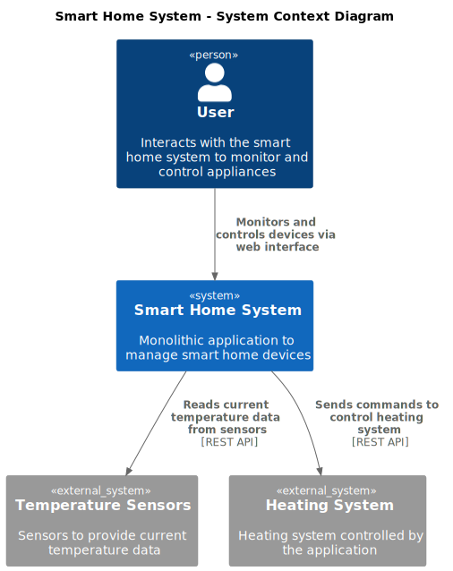
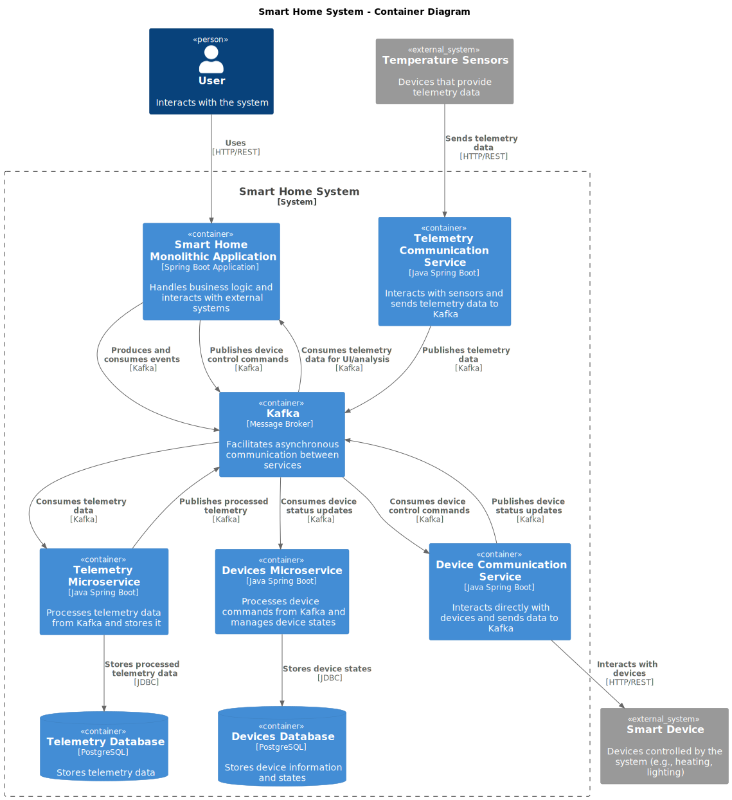
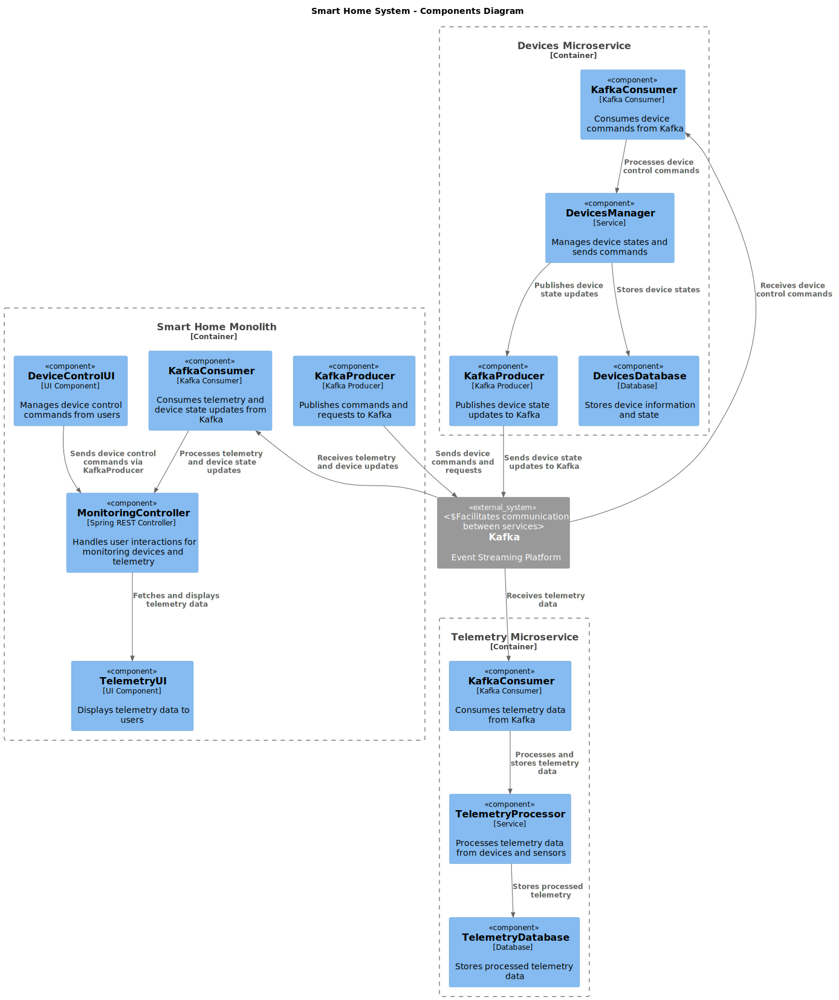
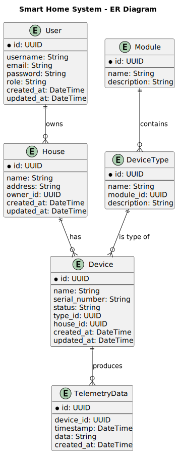

# Задание 1-1 Анализ и планирование 

### Анализ текущего состояния проекта

**Язык программирования**

- **Java**: Приложение разработано на Java версии 17.

**Фреймворк**

- **Spring Boot**: Приложение построено на Spring Boot (версия 3.3.2), обеспечивая веб-интерфейсы и взаимодействие с базой данных через Spring Data JPA.

**База данных**

- **PostgreSQL**: В качестве базы данных используется PostgreSQL, с подключением, настроенным через Spring Data JPA.

**Архитектура**

- **Монолитная**: Вся система, включая обработку запросов, бизнес-логику и работу с данными, реализована в одном приложении.

**Взаимодействие**

- **Синхронное**: Запросы обрабатываются последовательно, что характерно для монолитных приложений на базе Spring Boot.

**Масштабируемость**

- **Ограниченная**: Масштабирование таких приложений затруднено, так как требует изменений в масштабировании всей системы.

**Развертывание**

- **Требует полной перезагрузки**: Обновления или изменения требуют остановки и перезапуска приложения.



---

# Задание 1-2 Архитектура микросервисов

**Изменения в архитектуре**

- Добавлены два микросервиса:
  - Управление устройствами (**devices-service**)
  - Телеметрия (**telemetry-service**)




---

# Задание 1-3 Определение сущностей

### Структура сущностей

1. **Пользователь (User)**
   - **id**: уникальный идентификатор
   - **username**: имя пользователя
   - **email**: адрес электронной почты
   - **password**: зашифрованный пароль
   - **role**: роль (например, администратор, пользователь)
   - **created_at**: дата создания
   - **updated_at**: дата обновления

2. **Дом (House)**
   - **id**: уникальный идентификатор
   - **name**: название (например, "Квартира", "Дом")
   - **address**: адрес
   - **owner_id**: ссылка на владельца (User)
   - **created_at**: дата создания
   - **updated_at**: дата обновления

3. **Устройство (Device)**
   - **id**: уникальный идентификатор
   - **name**: имя устройства
   - **serial_number**: серийный номер
   - **status**: состояние (включено/выключено)
   - **type_id**: ссылка на тип устройства
   - **house_id**: ссылка на дом
   - **created_at**: дата создания
   - **updated_at**: дата обновления

4. **Тип устройства (DeviceType)**
   - **id**: уникальный идентификатор
   - **name**: название типа (например, "Термостат")
   - **module_id**: ссылка на модуль
   - **description**: описание

5. **Модуль (Module)**
   - **id**: уникальный идентификатор
   - **name**: название модуля
   - **description**: описание функций

6. **Телеметрия (TelemetryData)**
   - **id**: уникальный идентификатор записи
   - **device_id**: ссылка на устройство
   - **timestamp**: время получения данных
   - **data**: телеметрические данные (например, температура)
   - **created_at**: дата создания записи

### Связи между сущностями

- **Пользователь (User)** может владеть несколькими **Домами (House)**.
- **Дом (House)** может содержать несколько **Устройств (Device)**.
- **Устройство (Device)** связано с определённым **Типом устройства (DeviceType)**.
- **Тип устройства (DeviceType)** относится к **Модулю (Module)**.
- **Устройство (Device)** может иметь несколько записей **Телеметрии (TelemetryData)**.



---

# Базовая настройка

## Запуск сервисов

```
docker-compose up --build
```

## Настройка Kong

### Регистрация сервисов

```
curl -i -X POST http://localhost:8001/services/ \
  --data "name=devices-service" \
  --data "url=http://devices-service:5000"
```

### Создание маршрута

```
curl -i -X POST http://localhost:8001/services/devices-service/routes \
  --data "paths[]=/devices" \
  --data "strip_path=false"
```

### Регистрация второго сервиса

```
curl -i -X POST http://localhost:8001/services/ \
  --data "name=telemetry-service" \
  --data "url=http://telemetry-service:5001"
```

### Создание маршрута для второго сервиса

```
curl -i -X POST http://localhost:8001/services/telemetry-service/routes \
  --data "paths[]=/telemetry" \
  --data "strip_path=false"
```

## Проверка сервисов

### Проверка **devices-service**

Получение информации об устройстве:

```
curl http://localhost:8000/devices/device-1
```

Изменение состояния устройства:

```
curl -X PUT http://localhost:8000/devices/device-1/status \
  --data '{"status": "on"}' \
  -H "Content-Type: application/json"
```

Отправка команды устройству:

```
curl -X POST http://localhost:8000/devices/device-1/commands \
  --data '{"command": "set_temperature", "value": 22}' \
  -H "Content-Type: application/json"
```

### Проверка **telemetry-service**

Получение последних данных телеметрии:

```
curl http://localhost:8000/telemetry/device-1/telemetry/latest
```

Получение истории телеметрии:

```
curl http://localhost:8000/telemetry/device-1/telemetry
```

## Доступ к Swagger

Документация доступна по следующим URL:

- **devices-service**: `http://localhost:5000/doc`
- **telemetry-service**: `http://localhost:5001/doc`

## Остановка всех сервисов

```
docker-compose down -v
```
